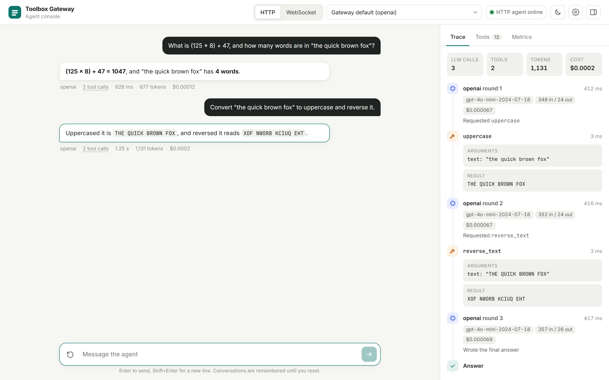
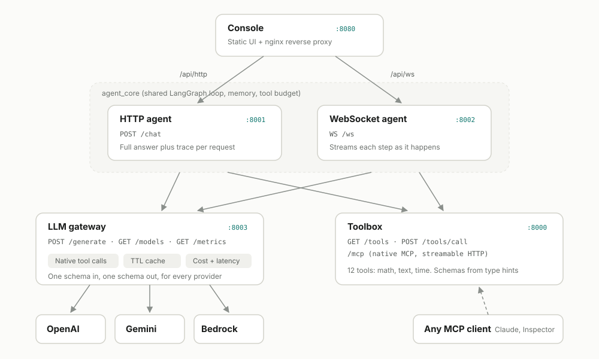
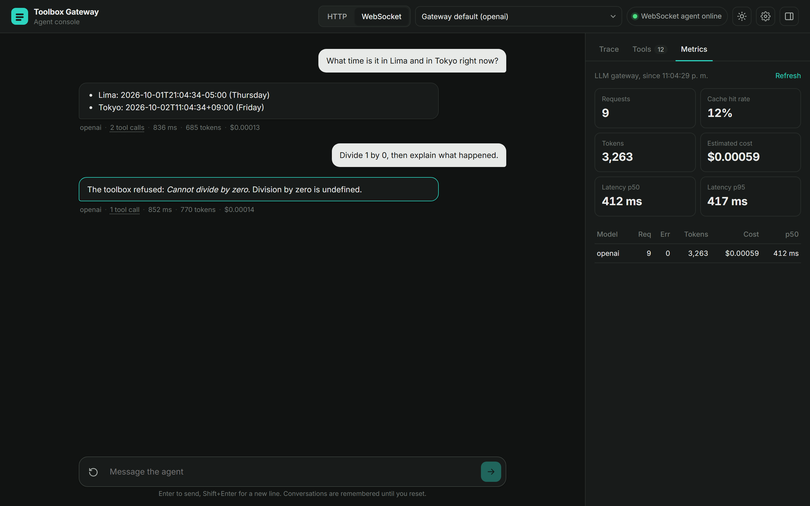
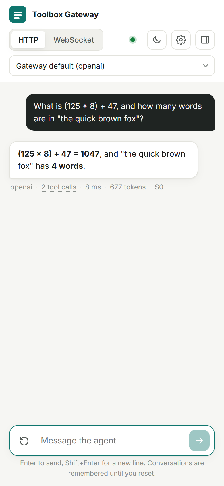

# Toolbox Gateway

[](https://github.com/LeonAchata/Toolbox-Gateway/actions/workflows/ci.yml)


A small, self-hosted platform for tool-using LLM agents. It is split into the pieces you would want to own separately in production: a **toolbox** that serves tools (over a JSON API and native MCP), an **LLM gateway** that puts OpenAI, Gemini and Bedrock behind one API, and two **agents** (HTTP and WebSocket) that run a LangGraph loop between them. A web console lets you chat with the agents and inspect every model call and tool call.



## Why it exists

Most agent demos wire one SDK straight into one script. That works until you want to switch providers, see what a run cost, reuse the same tools from another client, or stop an agent that keeps calling tools forever. This project draws those lines explicitly:

- **Agents never hold provider keys.** They talk to the gateway, which owns credentials, retries, caching and cost accounting.
- **Tools live in their own service.** Any agent can use them through the JSON bridge, and any MCP client (Claude Desktop, MCP Inspector, your own) can use them through `/mcp`.
- **Tool calling is native.** The gateway translates one provider-neutral schema into OpenAI function calling, the Bedrock Converse `toolUse` blocks and Gemini function declarations, then normalizes the reply. No prompt-engineered `TOOL_CALL:` parsing.
- **Every run is observable.** Each step reports model, latency, tokens, estimated cost and whether it was served from cache. LangSmith tracing turns on when you add a key.

## Architecture



| Service | Port | What it does |
| --- | --- | --- |
| `frontend` | 8080 | Static console behind nginx. Proxies `/api/http` and `/api/ws` to the agents, so the browser needs no CORS setup. |
| `agent-http` | 8001 | `POST /chat` returns the final answer together with the full trace. Good for integrations and scripts. |
| `agent-websocket` | 8002 | `WS /ws` streams each step (`llm_start`, `llm`, `tool`, `answer`, `done`) as it happens. Good for UIs. |
| `llm-gateway` | 8003 | `POST /generate`, `GET /models`, `GET /metrics`. Provider adapters, exact-match TTL cache, per-model metrics with p50 and p95 latency. |
| `toolbox` | 8000 | `GET /tools`, `POST /tools/call` and a native MCP endpoint at `/mcp`. |

Both agents are thin transports over the same `agent_core` package, so their behavior is identical.

### The agent loop

```
START -> agent --(tool calls?)--> tools -> agent -> ... -> finalize -> END
```

- The `agent` node sends the conversation and the tool catalog to the gateway.
- The `tools` node runs every requested call **concurrently** and feeds the results back, errors included, so the model can correct its own arguments.
- A round budget (`MAX_TOOL_ROUNDS`, default 6) stops runaway loops. On the last round the model is told to answer with what it has, and any unanswered calls are dropped from memory so the next turn is still valid for every provider.
- Conversations are kept per session with a LangGraph checkpointer. Only the last few user turns are sent back to the model, and history is always cut at a user message so a tool result is never separated from the call that produced it.

## Quick start

You need Docker and credentials for at least one provider.

```bash
git clone https://github.com/LeonAchata/Toolbox-Gateway.git
cd Toolbox-Gateway
cp .env.example .env        # add OPENAI_API_KEY, GOOGLE_API_KEY or AWS credentials
docker compose up --build -d
```

Open http://localhost:8080. The model picker lists every provider and greys out the ones without credentials. You can also name a model in the prompt ("use gemini, ...", "con bedrock ...").

Check that everything is healthy:

```bash
docker compose ps
curl localhost:8001/health
```

<p align="center">&nbsp;&nbsp;</p>

## Configuration

All settings are environment variables, read from `.env` by Docker Compose.

| Variable | Default | Notes |
| --- | --- | --- |
| `OPENAI_API_KEY` | | Enables the `openai` model. |
| `OPENAI_MODEL` | `gpt-4o-mini` | Any chat model that supports tools. |
| `OPENAI_BASE_URL` | | Point at any OpenAI-compatible server (vLLM, Ollama, LM Studio). |
| `GOOGLE_API_KEY` | | Enables the `gemini` model. |
| `GEMINI_MODEL` | `gemini-2.5-flash` | |
| `AWS_ACCESS_KEY_ID`, `AWS_SECRET_ACCESS_KEY` | | Enables `bedrock`. If empty, the default AWS credential chain is used, so instance and task roles work. |
| `AWS_REGION` | `us-east-1` | |
| `BEDROCK_MODEL_ID` | `us.amazon.nova-pro-v1:0` | Any Converse model with tool use. |
| `DEFAULT_MODEL` | | `openai`, `gemini` or `bedrock`. Empty picks the first provider with credentials. |
| `GATEWAY_API_KEY` | | Shared secret between agents and gateway. Empty disables auth. |
| `CACHE_ENABLED` | `true` | Exact-match response cache. Truncated or filtered replies are never cached. |
| `CACHE_TTL_SECONDS` | `3600` | |
| `MAX_TOOL_ROUNDS` | `6` | Upper bound on model and tool round trips per message. |
| `LANGSMITH_API_KEY` | | Set it together with `LANGSMITH_TRACING=true` to trace runs. |

The old model names (`gpt-4o`, `gemini-pro`, `bedrock-nova-pro`) still work as aliases.

## API

### Chat with the HTTP agent

```bash
curl -s localhost:8001/chat -H 'Content-Type: application/json' \
  -d '{"message": "What is (125 * 8) + 47?", "model": "gemini"}'
```

```json
{
  "session_id": "4f0c...",
  "answer": "(125 x 8) + 47 = 1047",
  "model": "gemini",
  "provider_model": "gemini-2.5-flash",
  "usage": {"llm_calls": 2, "tool_calls": 1, "input_tokens": 912, "output_tokens": 41, "cost_usd": 0.00038, "latency_ms": 1532.4},
  "trace": [
    {"type": "llm", "round": 1, "tool_calls": [{"name": "calculate", "arguments": {"expression": "(125 * 8) + 47"}}], "...": "..."},
    {"type": "tool", "name": "calculate", "result": "1047", "is_error": false, "duration_ms": 1.9},
    {"type": "llm", "round": 2, "finish_reason": "stop", "...": "..."},
    {"type": "answer", "content": "(125 x 8) + 47 = 1047"}
  ]
}
```

Send the `session_id` back to continue the conversation. `DELETE /sessions/{id}` forgets it. The original `POST /process` with `{"input": ...}` is still accepted.

### Stream from the WebSocket agent

```python
import asyncio, json, websockets

async def main():
    async with websockets.connect("ws://localhost:8002/ws") as ws:
        await ws.recv()  # {"type": "connected", ...}
        await ws.send(json.dumps({"type": "message", "content": "Uppercase 'mcp' and count its letters"}))
        while (event := json.loads(await ws.recv()))["type"] not in ("done", "error"):
            print(event["type"], event.get("name") or event.get("content") or "")

asyncio.run(main())
```

Other client messages: `{"type": "reset"}` starts a new conversation, `{"type": "ping"}` answers with `pong`. A second message sent while a turn is still running is rejected instead of being interleaved.

### Call the gateway directly

```bash
curl -s localhost:8003/generate -H 'Content-Type: application/json' -d '{
  "model": "openai",
  "messages": [{"role": "user", "content": "What is 17 * 23?"}],
  "tools": [{"name": "multiply", "description": "Multiply two numbers",
             "input_schema": {"type": "object", "properties": {"a": {"type": "number"}, "b": {"type": "number"}}, "required": ["a", "b"]}}]
}'
```

The response has the same shape for every provider: `content`, `tool_calls`, a normalized `finish_reason` (`stop`, `tool_calls`, `length`, `content_filter`), `usage`, `latency_ms`, `estimated_cost_usd` and `cached`. Errors come back as `{"error": {"type", "message"}}` with a meaningful status: 400 for an unknown model, 503 for a provider without credentials, 429 when the provider rate limits, 502 or 504 for upstream failures.

### Use the toolbox from any MCP client

The toolbox speaks MCP over streamable HTTP at `http://localhost:8000/mcp`. To try it with the MCP Inspector:

```bash
npx @modelcontextprotocol/inspector
# Transport: Streamable HTTP, URL: http://localhost:8000/mcp
```

For Claude Desktop, add it through the `mcp-remote` bridge:

```json
{
  "mcpServers": {
    "toolbox": { "command": "npx", "args": ["mcp-remote", "http://localhost:8000/mcp"] }
  }
}
```

## Built-in tools

| Category | Tools |
| --- | --- |
| math | `add`, `subtract`, `multiply`, `divide`, `power`, `calculate` (safe expression evaluator: `+ - * / // % **`, `sqrt`, `log`, `sin`, `pi`, ...) |
| text | `uppercase`, `lowercase`, `reverse_text`, `count_words`, `count_characters` |
| time | `current_time` (any IANA time zone) |

`calculate` parses the expression into an AST and only evaluates whitelisted nodes, so there is no `eval` and inputs like `__import__('os')` or `9 ** 99999` are rejected with a readable error.

## Extending

### Add a tool

A tool is a typed function. Its signature becomes the JSON Schema, its docstring becomes the description, and it is published on both the JSON bridge and the MCP endpoint.

```python
# toolbox/app/tools/text.py
@registry.register("text")
def slugify(text: Annotated[str, Field(description="Text to turn into a URL slug")]) -> str:
    """Lowercase the text and replace runs of non-alphanumeric characters with hyphens."""
    return re.sub(r"[^a-z0-9]+", "-", text.lower()).strip("-")
```

Arguments are validated before the function runs. Raise `ValueError` for expected failures: the message goes back to the model as a tool error instead of an HTTP 500.

### Add a provider

Subclass `Provider` in `llm-gateway/app/providers/`, implement `model_id`, `unavailable_reason()` and `_generate()`, translate the neutral messages to the provider format and back, then add the class to `PROVIDER_CLASSES`. The existing adapters show how tool calls, tool results and usage are mapped.

## Development

Each service is a standalone Python project with its own tests.

```bash
python -m venv .venv && source .venv/bin/activate
pip install -r toolbox/requirements-dev.txt -r llm-gateway/requirements-dev.txt -r agents/requirements-dev.txt ruff
make test     # pytest for toolbox, gateway and agents
make lint     # ruff check + ruff format --check
```

The tests do not need API keys. Provider adapters are tested against stubbed SDK clients built from the real SDK types, and the agent loop runs against a scripted gateway and toolbox through `httpx.MockTransport`. CI runs lint, the three test suites and a full `docker compose build` on every push.

```
.
├── agents/
│   ├── core/agent_core/     shared loop: graph, gateway and toolbox clients, sessions
│   ├── agent-http/          HTTP transport
│   ├── agent-websocket/     WebSocket transport
│   └── tests/
├── llm-gateway/
│   ├── app/providers/       openai.py, gemini.py, bedrock.py
│   ├── app/                 main.py, registry.py, cache.py, metrics.py, schemas.py
│   └── tests/
├── toolbox/
│   ├── app/tools/           math.py, text.py, time.py
│   ├── app/                 main.py (JSON bridge + MCP), registry.py
│   └── tests/
├── frontend/                index.html, app.js, styles.css, nginx.conf
└── docker-compose.yml
```

## Limitations

- Sessions, the cache and metrics live in process memory. They reset on restart and are not shared between replicas. Redis would be the next step for a multi-instance deployment.
- Cost figures come from a static price table in each adapter and are estimates. Models not in the table report a cost of zero.
- The agents trust the toolbox and the gateway on the internal network. Put the gateway behind `GATEWAY_API_KEY` and do not expose ports 8000 to 8003 publicly.

## License

MIT. See [LICENSE](LICENSE).
